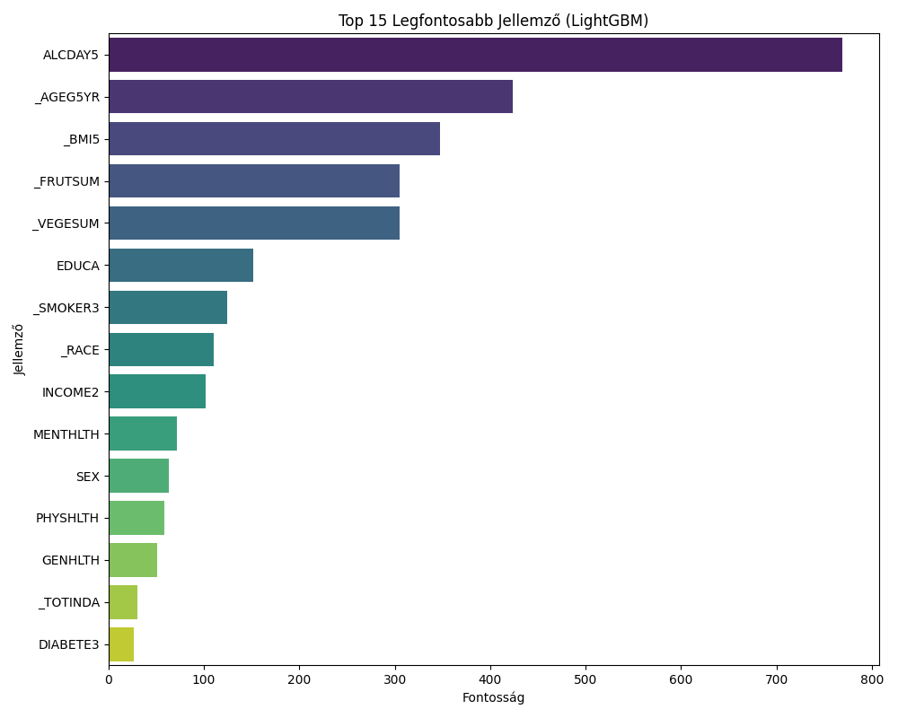
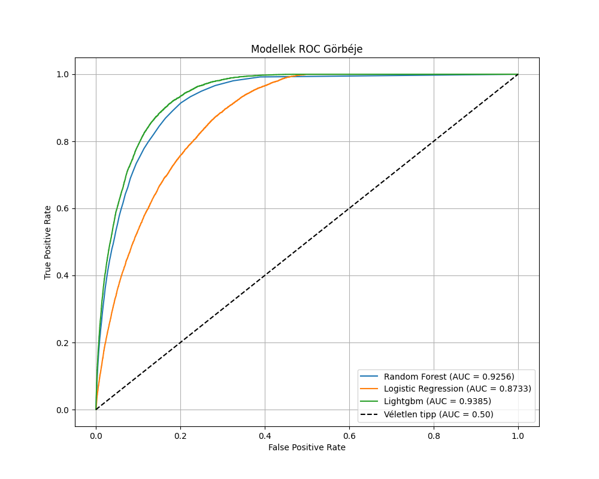

# BRFSS 2015: Predicting Problematic Alcohol Consumption with Machine Learning

## Project Overview

This project demonstrates an end-to-end machine learning pipeline for identifying individuals at risk of problematic alcohol consumption using the **Behavioral Risk Factor Surveillance System (BRFSS) 2015 dataset**. With over 440,000 respondents, this large-scale dataset provides a unique opportunity to tackle a real-world public health challenge.

My primary objective was to engineer a robust target variable based on CDC guidelines, train and systematically compare multiple classification models, and derive actionable insights by analyzing feature importances and constructing detailed risk profiles. The project showcases a comprehensive approach to handling imbalanced data, interpreting model performance, and translating complex results into a clear, data-driven narrative.

## Key Achievements & Technical Stack

-   **Model Performance:** I successfully trained a **LightGBM classifier** that achieved an **Area Under the Curve (AUC) of 0.939**, significantly outperforming both Random Forest and Logistic Regression baselines.
-   **High-Recall Screening:** The final model effectively identifies **91% of at-risk individuals (Recall)**, demonstrating its potential as a powerful and reliable tool for initial public health screening programs where minimizing false negatives is critical.
-   **Advanced Feature Engineering:** I designed and implemented a custom target variable (`alcohol_problem`) by combining multiple features (`_DRNKWEK`, `_RFBING5`, `MAXDRNKS`), creating a nuanced and clinically relevant definition of risk that goes beyond a single, noisy indicator.
-   **Insightful Risk Profiling:** Through deep analysis, I identified that the high-risk cohort is predominantly composed of **younger to middle-aged males (median age 35-39)**, who are also **current smokers** and report a **significantly higher median of poor mental health days.**
-   **Technical Stack:**
    -   **Python:** The core language for the entire project.
    -   **Pandas & NumPy:** For high-performance data manipulation, cleaning, and feature engineering.
    -   **Scikit-learn & LightGBM:** For building and evaluating machine learning models (Logistic Regression, Random Forest, LightGBM).
    -   **Matplotlib & Seaborn:** For creating insightful and publication-quality visualizations, including ROC curves and feature importance plots.
    -   **Git & GitHub:** For version control and collaborative project documentation.

## My Process & Methodology

### 1. Data Cleaning and Feature Engineering

The first step was to tame the raw BRFSS dataset. I created a `clean_brfss_data` function to systematically replace non-standard missing value codes (e.g., `7`, `9`, `99` for "Don't know/Refused") with `np.nan`.

The most critical part of this phase was creating the `TARGET_COLUMN`. Instead of relying on a single feature, I defined "problematic consumption" as meeting **at least two** of the following CDC-based criteria:
1.  **Heavy Drinking:** >14 drinks/week for men, >7 for women.
2.  **Binge Drinking:** At least one binge-drinking episode in the past 30 days.
3.  **High-Intensity Drinking:** Consuming more than 6 (men) or 5 (women) drinks on a single occasion.

This multi-faceted definition provides a more robust and clinically relevant target for the models.

### 2. Modeling and Evaluation

I recognized that the dataset was highly imbalanced (~5.6% positive class). To address this, I used the `class_weight='balanced'` parameter in all models, which automatically adjusts weights inversely proportional to class frequencies, forcing the model to pay more attention to the minority class.

I trained three distinct models to compare their strengths and weaknesses:
-   **Logistic Regression:** A strong, interpretable baseline.
-   **Random Forest:** A powerful ensemble model known for its robustness.
-   **LightGBM:** A high-performance gradient boosting framework, often a top performer on tabular data.

My evaluation focused on the **AUC score** for overall model discrimination and the **Classification Report** (Precision, Recall, F1-Score) to understand the practical trade-offs of each model.

### 3. Results and Insights

The comparative analysis yielded a clear winner:

| Model | AUC | Recall (At-Risk) | Precision (At-Risk) | Key Takeaway |
| :--- | :---: | :---: | :---: | :--- |
| Logistic Regression | 0.873 | 0.88 | 0.15 | Finds most cases but with too many false alarms. |
| Random Forest | 0.926 | 0.14 | 0.64 | Too conservative; misses the vast majority of at-risk individuals. |
| **LightGBM** | **0.939** | **0.91** | **0.24** | **The optimal balance: a highly effective screening tool.** |

The **LightGBM model** emerged as the superior choice. Its ability to capture 91% of at-risk individuals makes it ideal for a first-pass public health screening system. The feature importance plot and risk profiles further confirmed the strong comorbidity between problematic alcohol use, smoking, and mental health challenges, providing a clear direction for targeted interventions.




## How to Run This Project

1.  **Clone the repository:**
    ```bash
    git clone https://github.com/YOUR_USERNAME/brfss-alcohol-risk-analysis.git
    cd brfss-alcohol-risk-analysis
    ```

2.  **Set up the environment and install dependencies:**
    ```bash
    python -m venv venv
    source venv/bin/activate  # On Windows: venv\Scripts\activate
    pip install -r requirements.txt
    ```

3.  **Download the data:**
    -   Download the 2015 BRFSS dataset from [Kaggle](https://www.kaggle.com/datasets/cdc/behavioral-risk-factor-surveillance-system).
    -   Create a `data/` directory in the project root and place the `2015.csv` file inside it.

4.  **Run the analysis:**
    ```bash
    python alcohol_analysis.py
    ```
    The script will print the analysis steps to the console and save the output charts (`roc_curves.png`, `feature_importance.png`) to the root directory.
